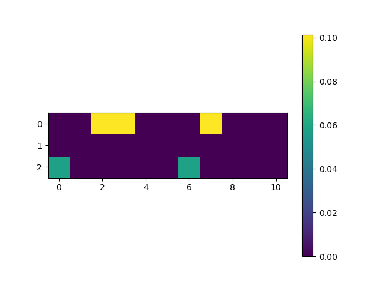

# Gaussian Filter 
$$ G(x,y) = \frac{1}{2*\Pi *\sigma^2} * exp (-\frac{x^2+y^2}{2*\sigma^2}) $$

# Term-Frequency, Invert-Document-Frequency, TF-IDF
#### Term-Frequency
$$
tf(t,d) = \frac{f_{t,d}}{\sum_{t'\epsilon d}f_{t',d}}
$$

$$
\text{tf}(t, d):  \text{The number appearance word t in document d} \\
\text{}{\sum_{t'\epsilon d}{f_{t',d}}}:  \text{Total word t in document d} \\
$$
#### Inverse Documents Frequency (tdf) calculation

$$
itf(t,D) = \log (\frac{N}{|{d \epsilon D : t \epsilon d}|})
$$

$$
\text{}N:  \text{Number d(documents) in D (corpus)} \\
\text{}{|{d \epsilon D : t \epsilon d}|}:  \text{Total appearance of word t in corpus D} \\
$$

#### TF-IDF calculation

$$
\text{}TF-IDF = tf(t,d) * itf(t,D)
$$
<body>

</body>

# How to use Einstein Summation for dot product

### Multiplying vector by vector 

* Output is scalar 

$$\vec{u} = \begin{pmatrix}u1 \\ u2 \\ u3 \end{pmatrix} ,\vec{v} = \begin{pmatrix} v1 \\v2 \\v3 \end{pmatrix}  $$
$$ \vec{u} * \vec{v} = u_1 * v_1 + u_2 * v_2 + u_3 * v_3$$
$$\vec{u}* \vec{v} = \sum_{i}^n {u_i * v_i} -> \vec{u} * \vec{v} =  \text{np.eintstein}('i,i ->', u,v) $$

### Mutiplying Matrix by vector

* Output is Matrix

$$ A  = \begin{bmatrix} a_{11} \space a_{12} \space a_{13}\\\ a_{21} \space  a_{22} \space a_{23} \end{bmatrix}, A \epsilon R^{m*n} $$
$$ \vec{u} = \begin{pmatrix} u_1\\u_2\\u_3 \end{pmatrix} , u \epsilon R^{n} $$

$$ A* \vec{u} = \begin{bmatrix} a_{11}*u_1 + a_{12}*u_2 + a_{13}*u_3 \\\ a_{21}*u_1 + a_{22}*u_2 + a_{23}*u_3 \end{bmatrix} $$

$$ A * \vec{v} = \begin{bmatrix}  \sum_{i=0}^n A_{i,j} * u_{j}\\\ \\\ \sum_{i=1}^n A_{i,j} * u_{j} \end{bmatrix}
-> A * \vec{u} = \text{np.einstein} ('ij,j->i', A,\vec{u}) $$

### Multiplying Matrix by Matrix 
$$ A = \begin{bmatrix} a_{11} \space a_{12}\space a_{13} \\\ a_{21} \space a_{22} \space a_{23} \end{bmatrix}
, A \epsilon R^{m*n} $$

$$B = \begin{bmatrix} b_{11} \space b_{12} \\\ b_{21} \space b_{22} \\\ b_{31} \space b_{32} \end{bmatrix}
, B \epsilon R^{n*k} $$

$$ A * B = \sum_{i,j,k} A_{ij} * B_{jk} -> A*B = \text{np.einstein}('ij,jk',A,B) $$

### Multiplying Tensor(3-Dimention) and Vector (Convert RGB space to Grey Scale)

$$A = \begin{bmatrix} \begin{bmatrix} r_{11} \space r_{12} \\\ r_{21} \space r_{22} \end{bmatrix}, \\\ \space\\\
    \begin{bmatrix} g_{11} \space g_{12} \\\ g_{21} \space g_{22}  \end{bmatrix}, \\\ \space \\\
    \begin{bmatrix} b_{11} \space b_{12} \\\ b_{21} \space b_{22} \end{bmatrix} \end{bmatrix} , A \epsilon R^{c,m,n} $$ 

$$ \vec{u} = \begin{pmatrix} u_1 \\\ u_2 \\\ u_3 \end{pmatrix} $$

$$ A* \vec{u} = \begin{bmatrix} r_{11} * u_1 + g_{11}*u_2 + b_{11}*u_3 \space \space \space \space r_{12} * u_1 + g_{12}*u_2 + b_{12}*u_3 \\\
r_{21} * u_1 + g_{21}*u_2 + b_{21}*u_3  \space \space \space \space r_{22} * u_1 + g_{22}*u_2 + b_{22}*u_3 \end{bmatrix}
-> A* \vec{u} = \text{np.einstein}('kij,k',A,\vec{u}) $$

### Multiplying Tensor(3-Dimention) and Tensor (3_Dimetion)
$$ A = \begin{bmatrix} \begin{bmatrix} x_{11} \space x_{12} \\\ x_{21} \space x_{22} \end{bmatrix}, \\\ \space\\\
    \begin{bmatrix} y_{11} \space y_{12} \\\ y_{21} \space y_{22}  \end{bmatrix}, \\\ \space \\\
    \begin{bmatrix} z_{11} \space z_{12} \\\ z_{21} \space z_{22} \end{bmatrix} \end{bmatrix} , A \epsilon R^{c,m,n} , \space

B = \begin{bmatrix} \begin{bmatrix} a_{11} \space a_{12} \space a_{13} \\\ a_{21} \space a_{22} \space a_{23} \end{bmatrix}, \\\ \space\\\
\begin{bmatrix} b_{11} \space b_{12} \space b_{13}  \\\ b_{21} \space b_{22} \space b_{23}  \end{bmatrix}, \\\ \space \\\
\begin{bmatrix} c_{11} \space c_{12} \space c_{13} \\\ c_{21} \space c_{22} \space c_{23} \end{bmatrix} \end{bmatrix} , B \epsilon R^{c,n,k} $$ 

$$ A*B = \text{np.einstein}('kij,kjl', A,B) $$

