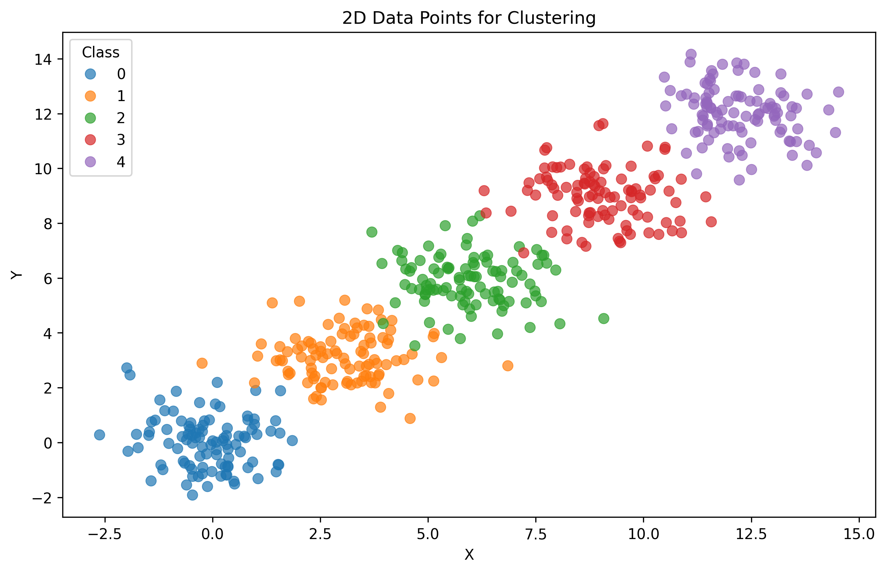
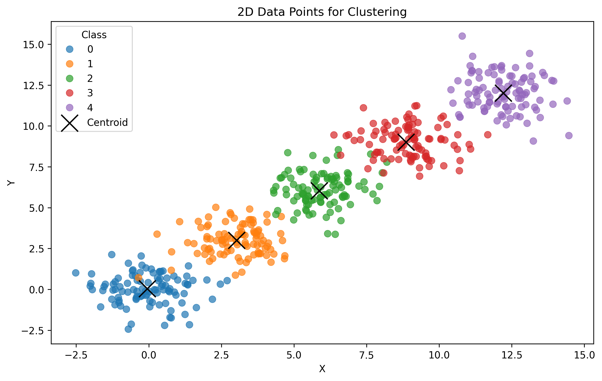

# KMean Clustering Algorithm 
* How it working 

* Step 1: Create 200 data point(2D)/class belong to 5 class

```python 
>>> def create_data_point(num_class = 5, num_points_per_class = 20):
>>>     data = []
>>>     for class_label in range(num_class):
>>>         x = np.random.normal(loc=class_label * 3, scale=1.0, size=num_points_per_class)
>>>         y = np.random.normal(loc=class_label * 3, scale=1.0, size=num_points_per_class)
>>>         data.append(pd.DataFrame({'x': x, 'y': y, 'class': class_label}))
>>>     df = pd.concat(data, ignore_index=True)
>>>     return df
>>> df = create_data_point(num_points_per_class=200)
```


* Step 2: Visualize data point
```python
>>> def visual(df):
>>>     plt.figure(figsize=(10, 6))
>>>     sns.scatterplot(data=df, x='x', y='y', hue='class', palette='tab10', s=50, alpha=0.7, edgecolor=None)
>>>     plt.title('2D Data Points for Clustering')
>>>     plt.xlabel('X')
>>>     plt.ylabel('Y')
>>>     plt.legend(title='Class')
>>>     plt.savefig('k-mean.png', dpi=300, bbox_inches='tight', pad_inches=0.1)
>>>     plt.show()
>>> visual(df)
```
<div>
    </img>
</div>


* Step 3: Calculate distance between point sample and each class point after that update centroid point
    untill have no different

```python
>>> number_row_of_centroid = self.__array_points.shape[0]
>>> centroids = self.__array_points[np.random.choice(number_row_of_centroid, self.__k, replace=False)]
```

```python 
>>> for _ in range(self.__max_iter):
>>>     distances = np.linalg.norm(self.__array_points_extend  - centroids, axis=2)
>>>     labels = np.argmin(distances, axis=1)
>>>     
>>>     new_centroids = np.array([self.__array_points[labels == i].mean(axis=0) for i in range(self.__k)])
>>>     if np.all(new_centroids == centroids):
>>>         break
>>>     

>>>     centroids = new_centroids
```

* Step 4: Results Visualization 

<div>
    </img>
</div>
