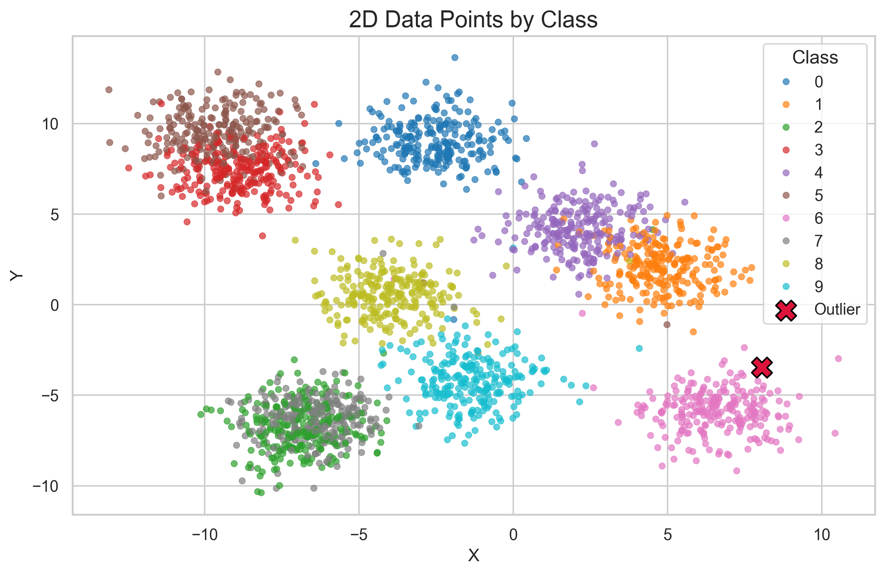

## In this unit you will learn 
* 1. KNN How does it working ?

## KNN
* Step 1: Create 200 data point(2D) belong to 5 class
```python 
>>> num_points_per_class = 20
>>> num_class = 5
>>> data = []
>>> for class_label in range(num_class):
>>>     x = np.random.normal(loc=class_label * 3, scale=1.0, size=num_points_per_class)
>>>     y = np.random.normal(loc=class_label * 3, scale=1.0, size=num_points_per_class)
>>>     data.append(pd.DataFrame({'x': x, 'y': y, 'class': class_label}))
>>> 
>>> df = pd.concat(data, ignore_index=True)
```
* Step 2: Visualize data point
```python 
>>> plt.figure(figsize=(10, 6))
>>> sns.set(style="whitegrid")
>>> plot = sns.scatterplot(data=df, x='x', y='y', hue='class', palette='tab10', s=40, alpha=0.7, edgecolor=None)
>>> 
>>> plot.set_title('2D Data Points by Class', fontsize=16)
>>> plot.set_xlabel('X', fontsize=12)
>>> plot.set_ylabel('Y', fontsize=12)
>>> plot.legend(title='Class', title_fontsize='13', fontsize='11')
>>> 
>>> plt.show()
```
<div>
    </img>
</div>

* Step 3: Randomly create point sample
```python 
>>> outlier_x = np.random.uniform(low=df['x'].min() , high=df['x'].max())
>>> outlier_y = np.random.uniform(low=df['y'].min() , high=df['y'].max() )
>>> outlier_df = pd.DataFrame({'x': [outlier_x], 'y': [outlier_y], 'class': ['outlier']})

>>> outlier_df.to_numpy()[0][0]
```

* Step 4: Calculate distance between point sample and each class point 
```python
>>> distance_matrix = np.sqrt((x_point-p_sample_x)**2 + (p_sample_y-p_sample_y))
>>> distance_matrix_sorted = np.sort(distance_matrix)
>>> distance_matrix
>>> array([ 0.24528056,  0.26942459,  0.36276598,  0.65997895,  0.72302382,
        0.78209333,  0.81487134,  0.88912347,  0.96173503,  0.97741619,
        0.99080529,  1.20618934,  1.40589357,  1.46345609,  1.63023526,
        1.89942285,  2.04116087,  2.10793351,  2.22218911,  2.39328027,
        2.40743446,  2.44782483,  2.4813848 ,  2.5170061 ,  2.58679893,
        2.63226353,  2.65545896,  2.67318026,  2.75792283,  2.77994161,
        2.79904581,  2.81040429,  2.82161704,  2.86353178,  2.87327406,
        2.89013807,  2.89053882,  2.94957825,  3.12829815,  3.24369462,
        3.25119698,  3.29617306,  3.38306218,  3.43821506,  3.54702571,
        3.67600305,  4.13145478,  4.20225064,  4.21126677,  4.25417672,
        4.35698406,  4.49513367,  4.58970182,  4.75954853,  4.83339198,
        5.05084492,  5.26580003,  5.55416507,  5.63224054,  5.65378504,
        5.67712121,  5.77686879,  6.21987835,  6.25084203,  6.34370803,
        6.60489812,  7.01237675,  7.20259351,  7.21911743,  7.23882315,
        7.26711966,  7.31238672,  7.31929113,  7.32130493,  7.35719764,
        7.43579668,  7.56965423,  7.59418276,  7.67822731,  7.68045155,
        8.0568486 ,  8.10075218,  8.28639721,  8.48421732,  9.44791982,
        9.62355107,  9.65586684,  9.71126156,  9.84793031, 10.07430663,
       10.10845844, 10.14910665, 10.24554755, 10.38663003, 10.60668239,
       10.84499061, 11.38190908, 11.39003371, 11.48052508, 11.96388775])

```
* Step 5: Find the K point have minnimum distance and we decide which class point sample belong to ? 
It's depend on number class in K sample it belong to.
```python 
>>> top_k = 8
>>> k_indice = [np.where(distance_matrix == element)[0][0] for element in distance_matrix_sorted[0:top_k]]
>>> k_indice
>>> print(f'Class belong to: {class_point[k_indice]}')
>>> Class belong to: [3 3 3 4 3 3 3 3]
>>> set_indice = set(class_point[k_indice])
>>> print(f'set indicate: {set_indice}')
>>> set indicate: {3, 4}
>>> repeat = [list(class_point[k_indice]).count(x) for x in set_indice]
>>> print(f'repeat: {repeat}')
>>> repeat: [7, 1]
>>> indice_max = np.array(repeat).argmax()
>>> print(f'max indicator: {indice_max}')
>>> max indicator: 0
>>> print(f'class belong to: {(list(set_indice))[indice_max]}')
>>> class belong to: 3
```
