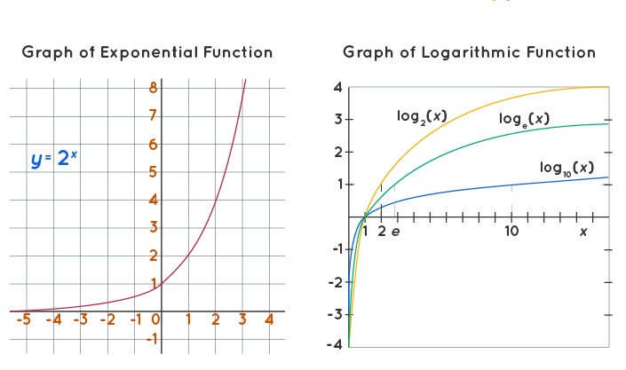

# Summarization all of knowledge in week1 module 1

1. Derivative Fomular and Applications
2. Logarit and Exponential function
3. Quadraric root calculation 
4. PI Estimation calculation 

# Derivative Fomular and Applications
$$f'(x) = \frac{dy}{dx} = \lim_{\Delta{x->0}} \frac{f(x+\Delta x) - f(x)}{\Delta x}$$

# Lograit and Exponenial function
$$f(x) = log(x)$$
$$f(x) = e^{x}$$

    
</img>

# PI Estimation Calculation
1 . Monte Carlo Method 
$$\pi = \frac{s^2 * N_{c}} {N_{s}}$$

1 . Gregory-Leibniz Series 
$$\pi = 4 * \sum_{i=1}^{n}\frac{(-1)^{i+1}}{2i -1}$$

1 . Nilakantha Series 
$$\pi =  3 + 4 * \sum_{i=0}^{n}\frac{(-1)^i}{(2i + 2)(2i+3)(2i+4)}$$

# Quadraric root Calculation 
$$x_{0} = a /2 $$ 
$$x_{n+1} = \frac{x_{n} + \frac{a}{x_n{}}}{2}$$
$$n = n=1$$

## How to alignment content in the markdown
[Link](https://stackoverflow.com/questions/12090472/how-do-i-center-an-image-in-the-readme-md-file-on-github)