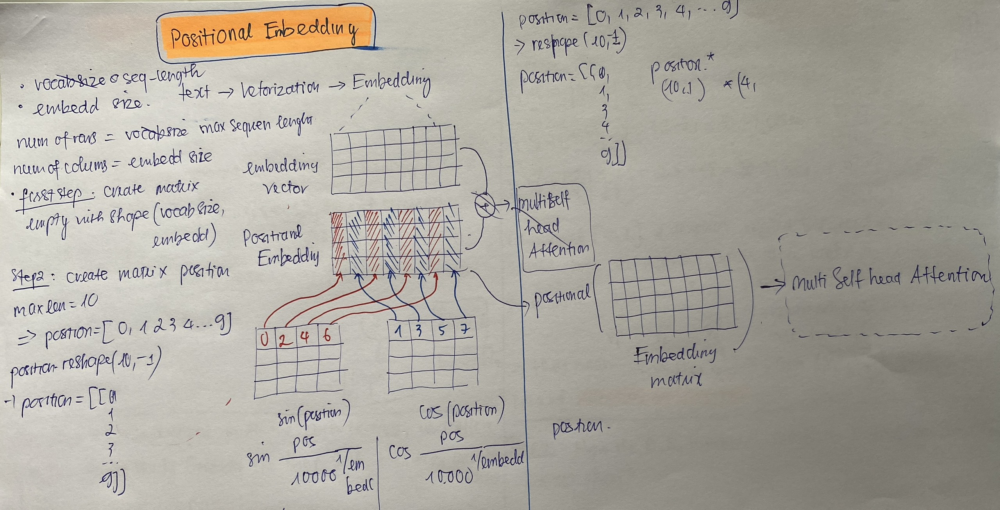
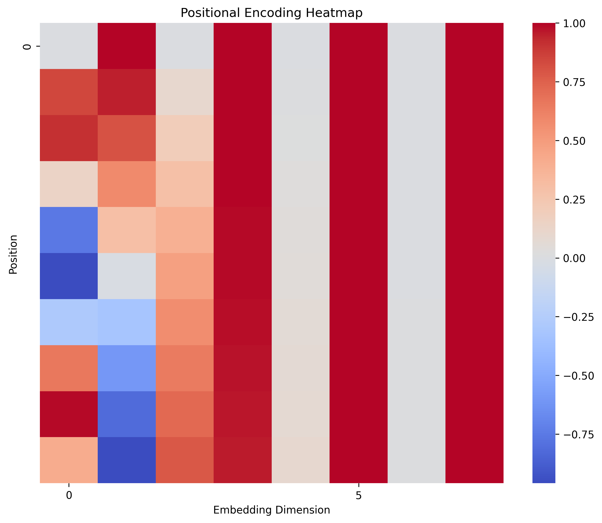

# How to instruction Positional Encoding
* Flow diagram below to instruct Positional Encoding 

<p>
  
  <p align="center"><em>Positional Embedding</em></p>.
</p>

# In Numpy
## Step 1: Create Embedding matrix (max_len = 10, embedd_dim = 8, T = 10000)

```markdown
pe = np.zeros((max_len, embedd_dim), dtype= np.float32)
>>> pe
[[0. 0. 0. 0. 0. 0. 0. 0.]
 [0. 0. 0. 0. 0. 0. 0. 0.]
 [0. 0. 0. 0. 0. 0. 0. 0.]
 [0. 0. 0. 0. 0. 0. 0. 0.]
 [0. 0. 0. 0. 0. 0. 0. 0.]
 [0. 0. 0. 0. 0. 0. 0. 0.]
 [0. 0. 0. 0. 0. 0. 0. 0.]
 [0. 0. 0. 0. 0. 0. 0. 0.]
 [0. 0. 0. 0. 0. 0. 0. 0.]
 [0. 0. 0. 0. 0. 0. 0. 0.]]

```

## Step 2: Create position, even position, odd position matrix
* Position 
```markdown
position = np.arange(0, max_len, dtype=np.float32).reshape(max_len,-1)
>>> position
[[0.]
 [1.]
 [2.]
 [3.]
 [4.]
 [5.]
 [6.]
 [7.]
 [8.]
 [9.]]
```

* Even Position
```markdown
even_position =  np.arange(0, embedd_dim, 2)
even_position = np.tile(even_postion, (max_len, 1))
>>> even_position
[[0 2 4 6]
 [0 2 4 6]
 [0 2 4 6]
 [0 2 4 6]
 [0 2 4 6]
 [0 2 4 6]
 [0 2 4 6]
 [0 2 4 6]
 [0 2 4 6]
 [0 2 4 6]]
```
* Odd Position 
```
odd_position =  np.arange(1, embedd_dim, 2)
odd_position = np.tile(odd_position, (max_len, 1))
>>> odd_position
[[1 3 5 7]
 [1 3 5 7]
 [1 3 5 7]
 [1 3 5 7]
 [1 3 5 7]
 [1 3 5 7]
 [1 3 5 7]
 [1 3 5 7]
 [1 3 5 7]
 [1 3 5 7]]
```

## Step 3: Calculate Sine Even Position and Cosine Odd Position

$$sin_{pos} = \sin(\frac{pos}{T^{\frac{i}{embedd\space dim}}})$$
$$cos_{pos} = \cos(\frac{pos}{T^{\frac{i}{embedd\space dim}}})$$

* Sine Position
```markdown
term_sin = np.sin(position / (np.power(10000,even_postion / embedd_dim)))
>>> term_sin
[[ 0.          0.          0.          0.        ]
 [ 0.84147098  0.09983342  0.00999983  0.001     ]
 [ 0.90929743  0.19866933  0.01999867  0.002     ]
 [ 0.14112001  0.29552021  0.0299955   0.003     ]
 [-0.7568025   0.38941834  0.03998933  0.00399999]
 [-0.95892427  0.47942554  0.04997917  0.00499998]
 [-0.2794155   0.56464247  0.05996401  0.00599996]
 [ 0.6569866   0.64421769  0.06994285  0.00699994]
 [ 0.98935825  0.71735609  0.07991469  0.00799991]
 [ 0.41211849  0.78332691  0.08987855  0.00899988]]
```
* Sine Position
```markdown
term_cos = np.cos(position / (np.power(10000,odd_position / embedd_dim)))
>>> term_cos
 [[ 1.          1.          1.          1.        ]
 [ 0.95041528  0.99950004  0.999995    0.99999995]
 [ 0.80657841  0.99800067  0.99998     0.9999998 ]
 [ 0.58275361  0.99550337  0.999955    0.99999955]
 [ 0.30113746  0.99201066  0.99992     0.9999992 ]
 [-0.01034232  0.98752602  0.999875    0.99999875]
 [-0.32079646  0.98205394  0.99982001  0.9999982 ]
 [-0.59943739  0.97559988  0.99975501  0.99999755]
 [-0.81863246  0.9681703   0.99968002  0.9999968 ]
 [-0.9566442   0.95977264  0.99959503  0.99999595]]
```
## Step 4: Assign Sine Even Position value and Cosine Odd Position into Positional Encoding
```markdown
pe[:, 0::2] = term_sin
pe[:, 1::2] = term_cos
>>> pe
[[ 0.0000000e+00  1.0000000e+00  0.0000000e+00  1.0000000e+00
   0.0000000e+00  1.0000000e+00  0.0000000e+00  1.0000000e+00]
 [ 8.4147096e-01  9.5041525e-01  9.9833414e-02  9.9950004e-01
   9.9998331e-03  9.9999499e-01  9.9999981e-04  9.9999994e-01]
 [ 9.0929741e-01  8.0657840e-01  1.9866933e-01  9.9800068e-01
   1.9998666e-02  9.9997997e-01  1.9999987e-03  9.9999982e-01]
 [ 1.4112000e-01  5.8275360e-01  2.9552022e-01  9.9550337e-01
   2.9995501e-02  9.9995500e-01  2.9999956e-03  9.9999952e-01]
 [-7.5680250e-01  3.0113748e-01  3.8941833e-01  9.9201065e-01
   3.9989334e-02  9.9992001e-01  3.9999895e-03  9.9999923e-01]
 [-9.5892429e-01 -1.0342319e-02  4.7942555e-01  9.8752600e-01
   4.9979169e-02  9.9987501e-01  4.9999794e-03  9.9999875e-01]
 [-2.7941549e-01 -3.2079646e-01  5.6464249e-01  9.8205394e-01
   5.9964005e-02  9.9981999e-01  5.9999642e-03  9.9999821e-01]
 [ 6.5698659e-01 -5.9943742e-01  6.4421767e-01  9.7559988e-01
   6.9942847e-02  9.9975502e-01  6.9999429e-03  9.9999756e-01]
 [ 9.8935825e-01 -8.1863248e-01  7.1735609e-01  9.6817029e-01
   7.9914697e-02  9.9968004e-01  7.9999147e-03  9.9999678e-01]
 [ 4.1211849e-01 -9.5664418e-01  7.8332692e-01  9.5977265e-01
   8.9878552e-02  9.9959505e-01  8.9998785e-03  9.9999595e-01]]
```
* Foundations Functional
```markdown
def position_encoding(max_len =5000, embedd_dim = 512):
    pe = np.zeros((max_len, embedd_dim), dtype= np.float32 )
    position = np.arange(0, max_len, dtype=np.float32).reshape(max_len,-1)
    even_postion =  np.tile(np.arange(0, embedd_dim, 2), (max_len, 1))
    odd_postion =  np.tile(np.arange(1, embedd_dim, 2), (max_len, 1))
    term_div_sin = np.sin(position / (np.power(10000,even_postion / embedd_dim)))
    term_div_cos = np.cos(position / (np.power(10000,odd_postion / embedd_dim)))
    pe[:, 0::2] =  term_div_sin
    pe[:, 1::2] =  term_div_cos

    return pe

>>> pe = position_encoding(max_len, embedd_dim)
>>> pe
[[ 0.0000000e+00  1.0000000e+00  0.0000000e+00  1.0000000e+00
   0.0000000e+00  1.0000000e+00  0.0000000e+00  1.0000000e+00]
 [ 8.4147096e-01  9.5041525e-01  9.9833414e-02  9.9950004e-01
   9.9998331e-03  9.9999499e-01  9.9999981e-04  9.9999994e-01]
 [ 9.0929741e-01  8.0657840e-01  1.9866933e-01  9.9800068e-01
   1.9998666e-02  9.9997997e-01  1.9999987e-03  9.9999982e-01]
 [ 1.4112000e-01  5.8275360e-01  2.9552022e-01  9.9550337e-01
   2.9995501e-02  9.9995500e-01  2.9999956e-03  9.9999952e-01]
 [-7.5680250e-01  3.0113748e-01  3.8941833e-01  9.9201065e-01
   3.9989334e-02  9.9992001e-01  3.9999895e-03  9.9999923e-01]
 [-9.5892429e-01 -1.0342319e-02  4.7942555e-01  9.8752600e-01
   4.9979169e-02  9.9987501e-01  4.9999794e-03  9.9999875e-01]
 [-2.7941549e-01 -3.2079646e-01  5.6464249e-01  9.8205394e-01
   5.9964005e-02  9.9981999e-01  5.9999642e-03  9.9999821e-01]
 [ 6.5698659e-01 -5.9943742e-01  6.4421767e-01  9.7559988e-01
   6.9942847e-02  9.9975502e-01  6.9999429e-03  9.9999756e-01]
 [ 9.8935825e-01 -8.1863248e-01  7.1735609e-01  9.6817029e-01
   7.9914697e-02  9.9968004e-01  7.9999147e-03  9.9999678e-01]
 [ 4.1211849e-01 -9.5664418e-01  7.8332692e-01  9.5977265e-01
   8.9878552e-02  9.9959505e-01  8.9998785e-03  9.9999595e-01]]
```
* Plot 
```markdown
def plot_positional_encoding(pe_matrix):
    plt.figure(figsize=(10, 8))
    sns.heatmap(pe_matrix[:, :], cmap='coolwarm', xticklabels=5, yticklabels=50)
    plt.xlabel('Embedding Dimension')
    plt.ylabel('Position')
    plt.title('Positional Encoding Heatmap')
    plt.savefig('positiona_outcom.png', dpi=300, bbox_inches='tight')
    plt.show()
```
<p>
  
  <p align="center"><em>Positional Embedding</em></p>.
</p>

# In Pytorch
```markdown
class PositionalEncoding(nn.Module):
    def __init__(self, embed_dim, max_len=5000):
        super(PositionalEncoding, self).__init__()
        pe = torch.zeros(max_len, embed_dim)
        position = torch.arange(0, max_len, dtype=torch.float).unsqueeze(1)
        term_sin = torch.exp(torch.arange(0, embed_dim, 2).float() * (-torch.log(torch.tensor(10000.0)) / embed_dim))
        term_cos = torch.exp(torch.arange(1, embed_dim, 2).float() * (-torch.log(torch.tensor(10000.0)) / embed_dim))

        pe[:, 0::2] = torch.sin(position * term_sin)
        pe[:, 1::2] = torch.cos(position * term_cos)
        pe = pe.unsqueeze(0).transpose(0, 1)
        self.register_buffer('pe', pe)

    def forward(self, x):
        x = x + self.pe[:x.size(0), :]
        return x

pos_enc = PositionalEncoding(embedd_dim, max_len)
pe_matrix = pos_enc.pe.squeeze(1)
>>> pe_matrix
tensor([[ 0.0000e+00,  1.0000e+00,  0.0000e+00,  1.0000e+00,  0.0000e+00,
          1.0000e+00,  0.0000e+00,  1.0000e+00,  0.0000e+00,  1.0000e+00],
        [ 8.4147e-01,  9.2180e-01,  1.5783e-01,  9.9801e-01,  2.5116e-02,
          9.9995e-01,  3.9811e-03,  1.0000e+00,  6.3096e-04,  1.0000e+00],
        [ 9.0930e-01,  6.9942e-01,  3.1170e-01,  9.9205e-01,  5.0217e-02,
          9.9980e-01,  7.9621e-03,  9.9999e-01,  1.2619e-03,  1.0000e+00],
        [ 1.4112e-01,  3.6764e-01,  4.5775e-01,  9.8214e-01,  7.5285e-02,
          9.9955e-01,  1.1943e-02,  9.9999e-01,  1.8929e-03,  1.0000e+00],
        [-7.5680e-01, -2.1631e-02,  5.9234e-01,  9.6832e-01,  1.0031e-01,
          9.9920e-01,  1.5924e-02,  9.9998e-01,  2.5238e-03,  1.0000e+00],
        [-9.5892e-01, -4.0752e-01,  7.1207e-01,  9.5065e-01,  1.2526e-01,
          9.9875e-01,  1.9904e-02,  9.9997e-01,  3.1548e-03,  1.0000e+00],
        [-2.7942e-01, -7.2968e-01,  8.1396e-01,  9.2919e-01,  1.5014e-01,
          9.9820e-01,  2.3884e-02,  9.9995e-01,  3.7857e-03,  1.0000e+00],
        [ 6.5699e-01, -9.3770e-01,  8.9544e-01,  9.0404e-01,  1.7493e-01,
          9.9755e-01,  2.7864e-02,  9.9994e-01,  4.4167e-03,  1.0000e+00]])
```

* Plot
<p>
  
  <p align="center"><em>Positional Embedding</em></p>.
</p>