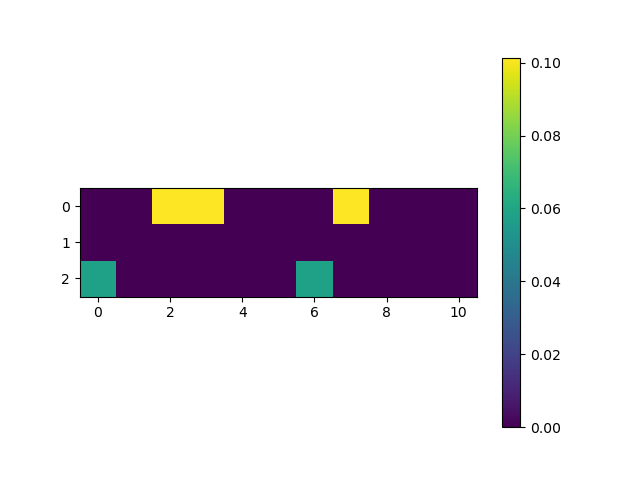

# Term-Frequency (tf) calculation
$$
tf(t,d) = \frac{f_{t,d}}{\sum_{t'\epsilon d}f_{t',d}}
$$

$$
\text{tf}(t, d):  \text{The number appearance word t in document d} \\
\text{}{\sum_{t'\epsilon d}{f_{t',d}}}:  \text{Total word t in document d} \\
$$
# Inverse Documents Frequency (tdf) calculation

$$
itf(t,D) = \log (\frac{N}{|{d \epsilon D : t \epsilon d}|})
$$

$$
\text{}N:  \text{Number d(documents) in D (corpus)} \\
\text{}{|{d \epsilon D : t \epsilon d}|}:  \text{Total appearance of word t in corpus D} \\
$$

# TF-IDF calculation

$$
\text{}TF-IDF = tf(t,d) * itf(t,D)
$$
<body>

</body>

